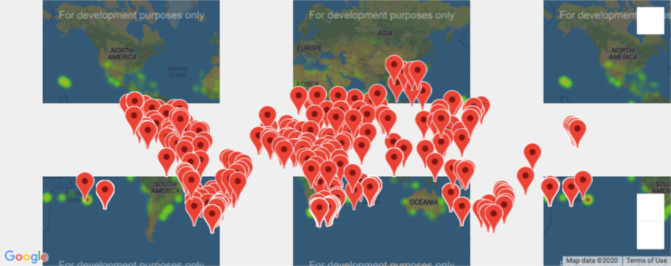

# Bootcamp: UCB-VIRT-DATA-PT-03-2020-U-B-TTH
### Bootcamp Challenge #6 - 4/19/2020
Bootcamp Challenge 6: Module World Weather with Pandas

### Jupyter Notebooks Created
- [Weather_Database](Weather_Database.ipynb)
- [Vacation_Search](Vacation_Search.ipynb)
- [Vacation_Itinerary](Vacation_Itinerary.ipynb)

### CSVs Created
- [WeatherPy_challenge](analysis/WeatherPy_challenge.csv)
- [WeatherPy_vacation](analysis/WeatherPy_vacation.csv)

### Map Images Created
- 
- [WeatherPy_travel_map][analysis/WeatherPy_travel_map.png]
- [WeatherPy_travel_map_markers][analysis/WeatherPy_travel_map_markers.png]

 	WeatherPy_travel_map.png 	update the challenge with the final run 	2 minutes ago
	WeatherPy_travel_map_markers.png
    
### Challenge Description
The goals for this challenge are for you to:
    Use nested try-except blocks.
    Use Pandas methods and attributes on a DataFrame or Series.
    Create a new DataFrame from a new API search with new weather parameters.
    Filter DataFrames based on input and nested decision statements, and logical expressions.
    Create pop-up markers on a Google map from a filtered DataFrame.
    Add a directions layer on a Google map between cities in the filtered DataFrame.

### Challenge Results
- Running Weather_Database produces as an output WeatherPy_challenge.csv. These results are those coordinate pairs that were verified against the openweather API server.
- Vacation_Search takes WeatherPy_challenge.csv as an input. This script has the user input min-max temperatures and yes/no for rain & snow. It then calls Google Places APIs in order to find the nearby Hotels and plots them each on a marker with custom HTML with augemented information. The output is saved to  WeatherPy_vacation.csv.
- Vacation_Itinerary takes WeatherPy_vacation.csv as an input. It then organizes all the data into a dictionary based on the country of the coordainte. It will continue to loop through the data until it finds 4 coordinates that are in the same country but different city and within 1000 miles of the last coordinate pair. Then it sorts the coordinates by latitude and uses Google maps to get the dirving directions and to display them on a map along with custom marker info.
